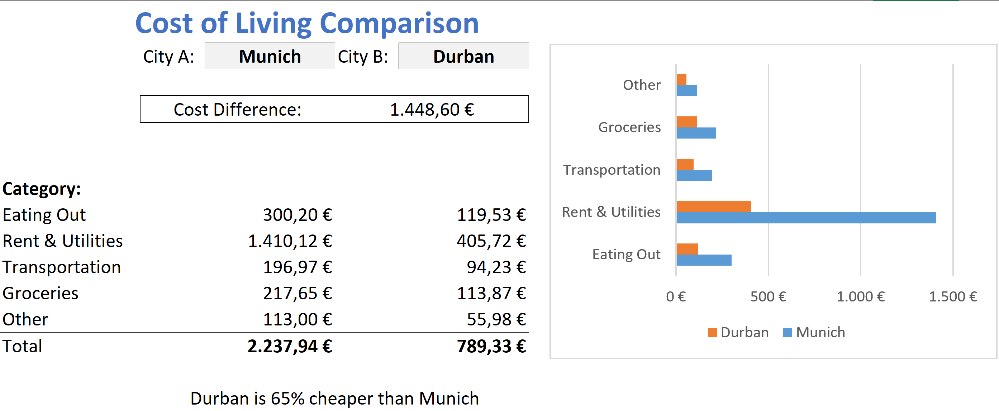

# Cost of Living Comparison Dashboard (Excel)

This project is an interactive Excel dashboard that compares the monthly cost of living between cities around the world — with a focus on everyday expenses such as rent, groceries, transportation, and more.

Built with:
- Python (data scraping + cleaning)
- Excel (Power Query, PivotTables, ComboBoxes, KPI calculations, visualization)

---

## Features

- **Dynamic city comparison** via dropdown menus
- Automatically updated data using Python web scraping
- Power Query data transformation (cleaning, currency formatting, filtering)
- KPI cards: total monthly cost, category breakdowns
- Auto-generated insights:
  - Cost difference
  - % cheaper city
- Interactive bar chart visualizing category-level differences

---

## What You'll Find in the Excel File

| Section          | Description                                 |
|------------------|---------------------------------------------|
| **Dashboard**     | Interactive view with dropdown selectors    |
| **Data Sheet**    | Cleaned and formatted scraped data          |
| **Power Query**   | Full ETL process for reproducible updates   |
| **Category Table**| Breakdown by cost group per city            |

---

## Tech Stack

- Excel (Power Query, PivotTables, Formulas)
- Python (Web scraping via BeautifulSoup + pandas)
- ComboBox (ActiveX) for user-driven selection

---

## About the Dashboard

This interactive Excel dashboard lets users compare the monthly cost of living between two cities side by side. It includes:

- Dynamic dropdowns to select cities

- Total monthly cost calculation

- Category-level breakdown (Rent, Groceries, Transportation, etc.)

- Visual comparison chart

- Automated insights like cost difference, % savings, and biggest gap

- Built fully in Excel using Power Query, formulas, and ComboBoxes — no macros required.

---

## Data Source

Cost data is scraped from:
https://www.livingcost.org/

Scraper pulls city-level monthly cost values, which are cleaned and transformed in Power Query to create a structured dataset.

